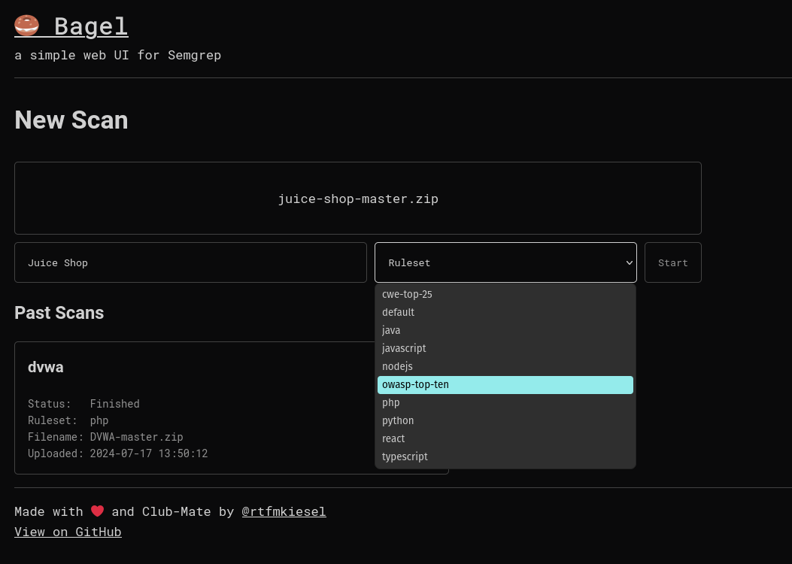
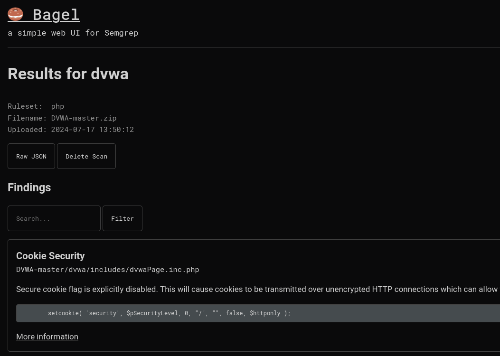

# 🥯 Bagel
Bagel is a simple web UI for [Semgrep](https://semgrep.dev/). This project was made to try out and learn [Gin](https://gin-gonic.com/) and [Gorm](https://gorm.io/index.html), so it may be highly unoptimized. Feedback is welcome!





## Usage
### Docker
If you want to run Bagel inside a Docker container, build and run the container with:
```sh
# or use 'make docker && make docker-run'
docker build -t bagel . 
docker run --rm -p 8080:8080 bagel
```

### Binary
If you have Golang and [Semgrep](https://semgrep.dev/) installed, and in your `$PATH`, you can build and run Bagel as a compiled binary. For this, build Bagel with:
```sh
# or use 'make'
go mod tidy
CGO_ENABLED=0 go build -ldflags="-s -w" -o bagel
```

And then run it with `./bagel`. It should now be accessible on `http://127.0.0.1:8080`.

### Semgrep Pro
Semgrep Pro is supported. For this, pass the `SEMGREP_APP_TOKEN` ENV variable to the running binary or the Docker container.

## License
This project is licensed under the [Apache License 2.0](https://www.apache.org/licenses/LICENSE-2.0). The fonts `Roboto` and `RobotoMono` are licensed under the [Apache License 2.0](https://www.apache.org/licenses/LICENSE-2.0).

This project is not affiliated with [Semgrep](https://semgrep.dev/).